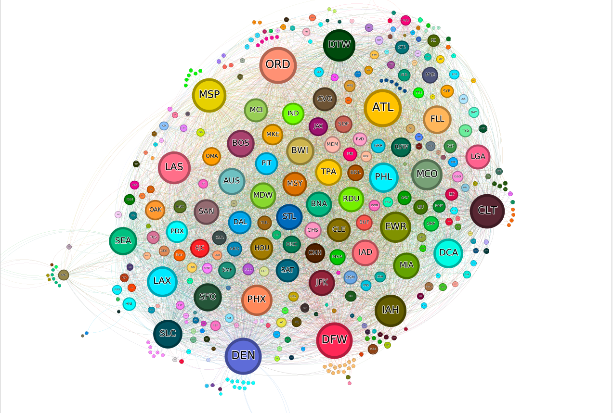

# Flight Delay and Cancellation Analysis (2009-2018)

## Overview
This project analyzes a comprehensive dataset of airline delays and cancellations from 2009 to 2018. The aim is to uncover patterns and insights using Apache Spark and to implement the PageRank algorithm to identify key airports in the network.

## Table of Contents
- [Flight Delay and Cancellation Analysis (2009-2018)](#flight-delay-and-cancellation-analysis-2009-2018)
  - [Overview](#overview)
  - [Table of Contents](#table-of-contents)
  - [Introduction](#introduction)
  - [Dataset Overview](#dataset-overview)
  - [Methodology](#methodology)
  - [Findings and Insights](#findings-and-insights)
  - [Visualizations](#visualizations)
  - [Running the Notebook](#running-the-notebook)

## Introduction
This project focuses on the implementation of the PageRank algorithm to understand the centrality of airports in the US flight network.

## Dataset Overview
The dataset used is the "Airline Delay and Cancellation Data 2009-2018" from Kaggle, which can be found [here](https://www.kaggle.com/datasets/yuanyuwendymu/airline-delay-and-cancellation-data-2009-2018/data). It includes details on flight delays, cancellations, and reasons for delays.

## Methodology
The analysis follows these steps:
- Data Preprocessing: Cleaning and structuring the data for analysis.
- Graph Creation: Representing airports as vertices and flights as edges.
- PageRank Implementation: Using Spark to execute the PageRank algorithm.
- Analysis: Interpreting the PageRank scores to identify crucial nodes (airports) in the network.

## Findings and Insights
The analysis revealed:
- The most central airports in terms of connectivity and flight volume.
- Patterns in flight delays and cancellations over the 10-year period.

## Visualizations
Visual representations of the data and analysis results are included, such as graphs showing the network of flights and the most central airports.



## Running the Notebook
To run the Jupyter notebook:
```bash
docker-compose up
```
```bash
jupyter notebook
```